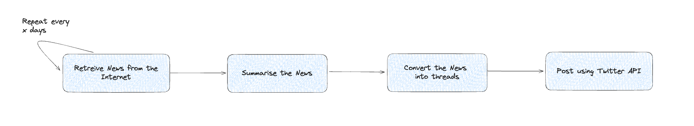

# Goal

To take the latest news from a few different industries (say AI and Crypto) over the last couple of days and summarise them into twitter threads. Posting these threads should, theoretically, help you grow your following on twitter and thus help you build your brand.

# Modules Required 

- News Retrieval 
- Summarisation of News
- Conversion of News to Threads
- Post Threads on X / Twitter
- Cron Job Setup

 

