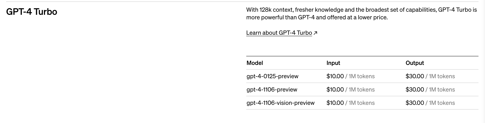
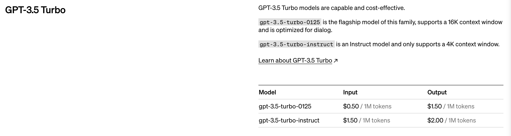
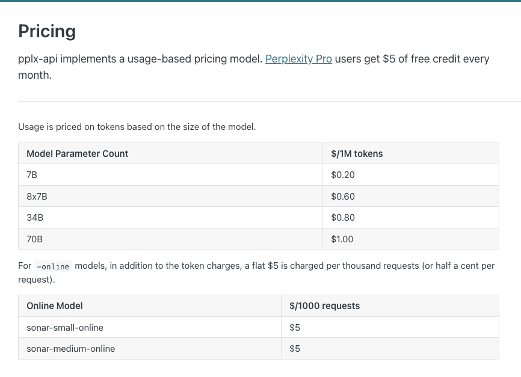

# Create Tweets 

Once the news retrieval and the summarisation modules are done, the next step is to create the tweets. There are 3 main options to create the tweets. They are:

- GPT-4 Turbo by OpenAI
- GPT-3.5 Turbo by OpenAI
- Perplexity AI's LLM

# GPT-4 Turbo by OpenAI

The good part of the GPT-4 Turbo is that it is the most powerful model out of the three. It has been trained on data up till Dec 2023 and thus should be able to generate responses that are in line with the current trends. However, it is also the most expensive model out of the three. It is actually insanely expensive when compared to the other two models. The pricing plan can be found below:

 

 

The pricing plan splits the costs into 2 parts. One is the input tokens and the other is the output tokens. The input tokens cost $10/1M tokens and the output tokens cost $30/1M tokens which makes it almost 30 times as expensive as the Perplexity AI's LLM. While the GPT-4 Turbo is the most powerful model, I think the pricing is a bit too high for me to use it for this project. I will keep an eye on the pricing as the days go by and see if I want to switch to the GPT-4 Turbo in the future.

# GPT-3.5 Turbo by OpenAI

The GPT-3.5 Turbo is the middle ground between the GPT-4 Turbo and the Perplexity AI's LLM. It is not as powerful as the GPT-4 Turbo, but it is also not as expensive. Additionally, having used the GPT-3.5 Turbo through ChatGPT and some of the Perplexity AI's LLM models, I'd say that the GPT 3.5 Turbo out perfroms the Perplexity AI's LLM in terms of the quality of the responses. The pricing plan can be found below:

 

 

While the GPT-3.5 Turbo is a bit more expensive than the Perplexity AI's LLM, I think the quality of the responses from the GPT-3.5 Turbo is worth the extra cost. That being said, my only past experience with Perplexity AI's LLM has been through their free plan, which I am assuming uses some of their weakest models. So, at the moment, I am leaning towards running a few quick tests with the GPT-3.5 Turbo and the Perplexity AI's LLM to see which one I like better.

# Perplexity AI's LLM

The most expensive of the models offered by Perplexity AI is the `70B` model. It costs $1 per 1M tokens and is the most powerful model that they offer. Since, it is the most powerful model that they offer, i wanna give them the benefit of the doubt and say that it should be able to match up to the GPT-3.5 Turbo. Additionally, it is also the cheapest of the 3 options that are outlined in this document. The pricing plan can be found below:

 

 

On paper, Perplexity AI's LLM seems like the best option. It is the cheapest of the 3 models and is also the most powerful model that they offer. However, I have not used the `70B` model before, so I am not sure how it compares to the GPT-3.5 Turbo. I will run a few quick tests with the GPT-3.5 Turbo and the Perplexity AI's LLM to see which one I like better.

# Conclusion

I will run a few quick tests with the GPT-3.5 Turbo and the Perplexity AI's LLM to see which one I like better. I will most probably be using one of these two models for this project. The GPT-4 Turbo is a bit too expensive for me to use for this project. I will keep an eye on the pricing as the days go by and see if I want to switch to the GPT-4 Turbo in the future.

