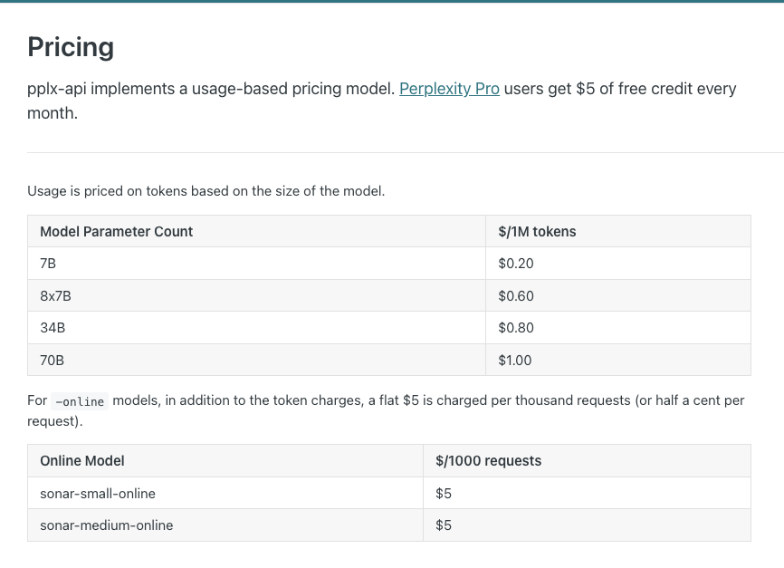

# News Retrieval

There are two main options to retrieve news from the internet. They are 
- Custom scraper + Bright Data API
- Serper Google Search API
- Perplexiy AI's Pro Search

# Custom Scraper + Bright Data API

[Link to Bright Data](https://brightdata.com/)

In the interest of time, and just because I don't really want to work with either Selenium or Puppeteer for this project, I am going to steer away from building a web scraper from scratch. Additionally, the Bright Data API costs some money as well, so no real incentive to use Bright Data and build a web scraper from scratch.

# Serper Google Search API

[Link to Serper Google Search API](https://serper.dev/)

The Serper Google Search API is on a credits model, meaning that you only pay for the number of credits that you use. And they have a free trial that gives you free 2500 queries. The rest of the pricing plan can be found below:

 

 

A sample of the Serper Google Search API can be found below. It is nice that they have a direct way to get the news from the internet, but the sample response looks like it just returns the url of the news articles / other links from the google search api. Thus, in order to get the content of the sites that the google search api returns, you would need to use a web scraper on top of the Serper Google Search API. Additionally, they also have a limit of 10 links per query, so you would need to make multiple queries to get all the news articles that you want. 

 

 

One interesting thing is that they also have a [LangChain integration](https://python.langchain.com/docs/integrations/providers/google_serper) which is pretty cool. Will come back to this at a later time when I have a bit more time to play around with LangChain and all of its integrations. 

# Perplexity AI's Pro Search 

[Link to PPLX Online LLMs](https://www.perplexity.ai/hub/blog/introducing-pplx-online-llms)
[PPLX Docs](https://docs.perplexity.ai/docs/getting-started)

This is a pretty interesting. Perplexity's Pro Search should be able to not just get the latest news articles from the internet, but also be able to summarise them as well. This helps combitne both the news retrieval and summarisation of news modules into one. It also has an integration with the LangChain API, which makes switching between the Perplexity Model and other models pretty easy.

That being said, it comes with a price. The pricing plan can be found below:

 

 

I will most probably be using the `70B` model for this project as I want to optimise for the quality of the responses from the LLM. 1$ per 1M tokens does not seem too bad, but I'll keep an eye on the pricing as the days go by and see if I want to drop to a less powerful model to save some money.

There is also the option of gettig the Perplextiy Pro Subscription which gives you $5 in credits. However, running the 70B model once each day for a month should consume less than $20 in credits, thus making the Pro Subscription not worth it. I think i will stick to the pay as you go model for now.

# Conclusion 

All in all, I think I will be using the Perplexity AI's Pro Search for this project. It is a bit more expensive than the Serper Google Search API, but it is a lot more powerful and can do a lot more things. Additionally, I have also been wanting to play around more with the LangChain API, so this is a good opportunity to do so. Perplexity AI's pro search it is!